# **📦 Projeto de Almoxarifado com Django**
---
Este projeto tem o propósito de ser um sistema para cadastro e aloção de itens, como um inventário, facilitando o registro e a logistica. Possuindo um sistema completo de cadastro de úsuarios com a função de transferência de items entre úsuarios.

```mermaid
flowchart TD
    A[Usuário A faz Login] --> B{Item disponível?}
    B -- Não --> C[Permanecerá com o dono]
    B -- Sim --> D[Item marcado como Emprestável]
    
    D --> E[Usuário B solicita empréstimo]
    E --> F((Transação Ativa))
    
    F --> G[Usuário B finaliza uso]
    G --> H[Processo de Devolução]
    H --> I[Item retorna para dono]
    I --> J[Fim] 
```



### Tecnoligias Utilizadas

*[Python](https://www.python.org/)

*[Django](https://www.djangoproject.com/)

*[Faker](https://faker.readthedocs.io/en/master/)

## Dependências e Versões Necessárias

* Python - Versão: 3.13.5

## Como rodar o projeto ✅

Clone git ou Baixe o arquivo ZIP

Acesse a pasta \Projeto_Almoxarifade_Django no seu terminal

Crie um ambiente virtual rode o comando:
```
pip install -r requirements.txt
```
Depois com o ambiente habilitado execute o comando:
```
python manage.py runserver
```
E acesse o link que aparecerá no terminal 

## 📁 Estrutura do Projeto:

- `storage/`: App principal (Models, Views, Templates e Urls)
- `utils/`: Scripts auxiliares (Geração de dados)
- `project/`: Configurações do Django

## Como Testar:

### Gerando Dados de teste
Usado para popular banco de dados com dados fictícios (usuários e itens) para fins de teste de interface e performance, utilize o script de mock data:

⚠️ <samp>AVISO: O script deletará todos os dados atuais do banco!</samp>

Acesse o arquivo
```text
Projeto_Almoxarifado_Django/
├── project/
├── storage/
│   ├── models.py
│   └── views.py
└── utils/                <-- Pasta de utilitários
    ├── 📌 list_itens.py
```

 com o comando:

```
cd Projeto_Almoxarifado_Django/utils
```

e execute o comando:

```
python create_objects.py
```
---
#### Geração de dados customizada

Se desejar é possivel alterar o tipo de item que será gerado alterando o objetos na lista ***objects*** seguindo o caminho:

```text
Projeto_Almoxarifado_Django/
├── project/
├── storage/
│   ├── models.py
│   └── views.py
└── utils/                <-- Pasta de utilitários
    ├── 📌 list_itens.py
```

## ⏭️ Próximos passos

### Possivéis melhorias para este projeto:
Adicionar features como o usuário poder criar um tempo limite para um empréstimo de item, e penalidades caso o usuário que pegou emprestado não o devolva.

---
Criar a feature para os usuários poderem criar grupos e definir quem irá poder ver e poder transferir os Items.

---
Criar a função de poder transferir apenas uma quantidade específicas de unidades do Item ao invés de tomar todas as unidades de um tipo de Item.